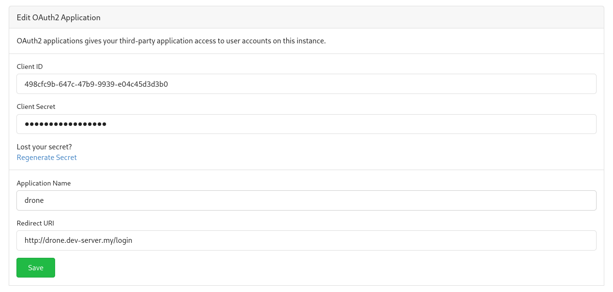

# Drone installation ok k3s

Drone is a self-service Continuous Integration platform for busy development teams.

Project page: [https://www.drone.io](https://www.drone.io)

### Requirements
- k3s cluster
- kubectl
- helm
- git server installed on cluster

### Installation

#### Create a namespace for drone server and runners

```bash
kubectl create namespace drone
```

#### Install drone server

Gitea server should be already installed. Go to Settings -> Applications -> Create application


Copy Client ID and Client Secret to [server-values.yaml ]({{repo.url}}/service/drone/server-values.yaml) and add gitea server url:
`DRONE_GITEA_CLIENT_ID`
`DRONE_GITEA_CLIENT_SECRET`
`DRONE_GITEA_SERVER`

Add Helm repo:

```bash
helm repo add drone https://charts.drone.io
```

```bash
helm repo update
```

Install drone server:

```bash
helm install drone drone/drone -f server-values.yaml --namespace drone
```

#### Install drone runner

```bash
helm install drone-runner-kube drone/drone-runner-kube -f runner-values.yaml --namespace drone
```

More details [here](https://github.com/drone/charts/blob/master/charts/drone-runner-kube/docs/install.md)

#### Expose Drone installation

The DNS record pointing to cluster IP should be created, the host should be set to [ingress.yaml]({{repo.url}}/service/drone/ingress.yaml) (spec.rules.host)

Expose http UI using Ingress service:

```bash
kubectl apply -f ingress.yaml
```
