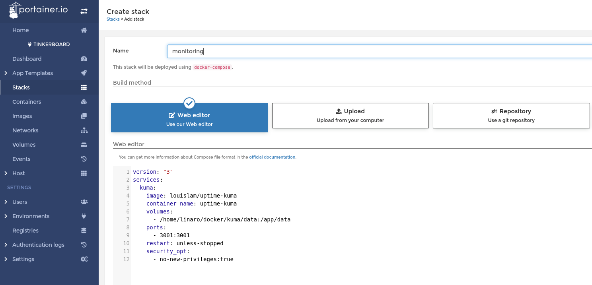
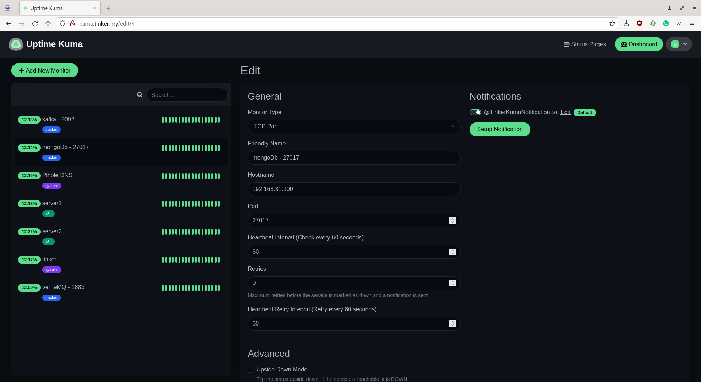

# Services monitoring using Uptime Kuma

Uptime Kuma is a self-hosted monitoring tool. 

It is used for monitoring uptime for HTTP(s) / TCP / HTTP(s) Keyword / Ping / DNS Record / Push / Steam Game Server / Docker Containers.

It has Reactive, Fast UI/UX. Uptime Kuma supports notifications via Telegram, Discord, and 90+ notification services.

### Manual installation via Portainer

In Portainer UI select Stacks -> Add stack

Add docker-compose yaml configuration:


```yaml
version: "3"
services:  
  kuma:
    image: louislam/uptime-kuma
    container_name: kuma
    volumes:
      - /home/linaro/docker/kuma/data:/app/data
    ports:
      - 3001:3001
    restart: unless-stopped
    security_opt:
      - no-new-privileges:true
```

Press deploy stack. That's it, the service was deployed to Docker. 

You can add DNS record with readable host name using Pi-hole, and bind the traffic to port 3001 using Nginx Proxy Manager.

Then add monitors for your services using Uptime Kuma UI

