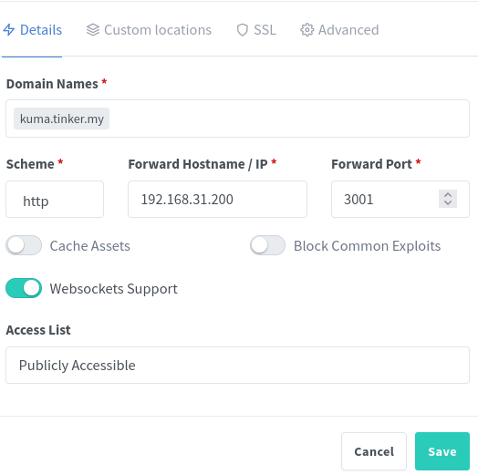

# Configuring nginx reverse proxy

Nginx Proxy Manager is a NGINX server with easy to use UI. It listens on port 80 and 443 and routes the requests for your services (ip:port).

First, you need to add a DNS record with domain, pointing to Nginx Proxy IP address.

Then, add a new new proxy, click Add Proxy Host:

After you save it, your service is accessible on your selected domain name.