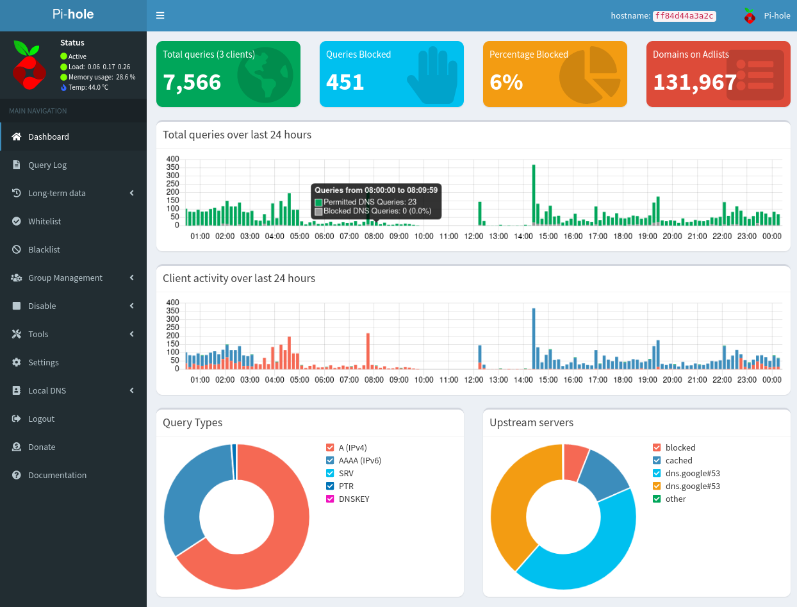
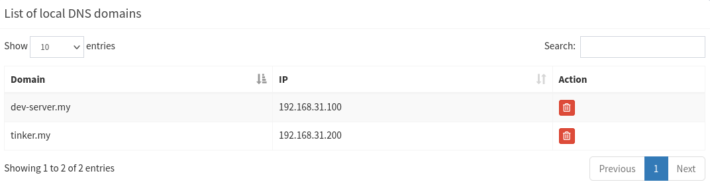
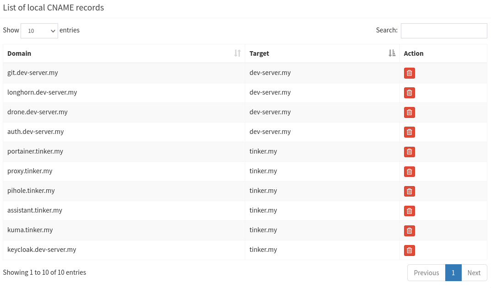

# Private DNS using Pi-hole

PI-hole is a private DNS server, DNS sinkhole (DNS level ad blocker), DHCP server.



### Installation

You can install Pi-hole on docker:

```yaml
version: "3"

services:
  pihole:
    container_name: pihole
    image: pihole/pihole:2022.07.1
    # For DHCP it is recommended to remove these ports and instead add: network_mode: "host"
    ports:
      - "53:53/tcp"
      - "53:53/udp"
      - "67:67/udp"
      - "8080:80/tcp"
    environment:
      TZ: 'Europe/Kiev'
      DNSMASQ_USER: root
      WEBPASSWORD: somepass
    volumes:
      - '/home/linaro/docker/pihole/etc-pihole:/etc/pihole'
      - '/home/linaro/docker/pihole/etc-dnsmasq.d:/etc/dnsmasq.d'
    cap_add:
      - NET_ADMIN
    restart: always
```

[Docker Pi-hole Github page](https://github.com/pi-hole/docker-pi-hole/blob/master/README.md)

### Add DNS entries

First, you need to add a DNS record. Press **Local DNS** -> **DNS Records**. Add a desired domain and associated IP address.



Then, you can add as many subdomains as you want using CNAME records menu. The subdomains path should point to the main domain name, which was created previously:



### Using Pi-hole DNS

You can add Pi-hole instance IP address as a DNS server for individual machine (using network settings), or you can add it to tour router settings, so all the machines in your network can use it.