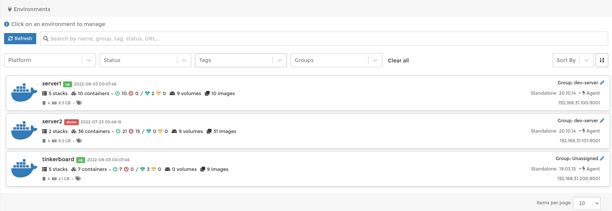
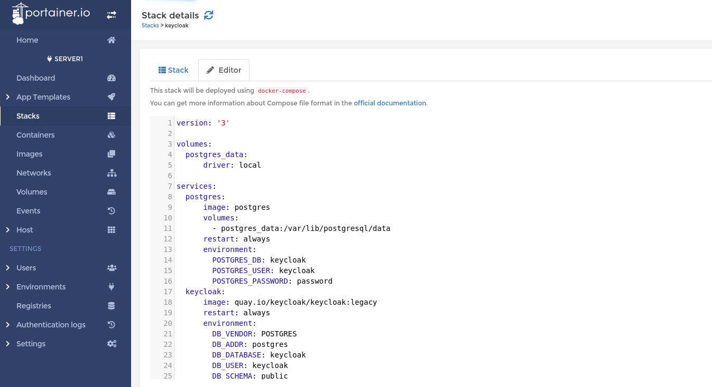

# Deploy to Docker using Portainer

Portainer is a Docker management tool, which can be deployed to Docker itself. 
It can be used as a standalone service, or as a server-agent combination. 
With the last one you can install portainer agents to multiple machines, and manage them from portainer server.

### Portainer Agent

Installed on all Docker machines:

```yaml
version: "3.6"
services:         
  portainer-agent:
    image: portainer/agent:latest
    container_name: portainer-agent
    restart: always
    volumes:
      - /etc/localtime:/etc/localtime:ro
      - /var/run/docker.sock:/var/run/docker.sock:ro
    ports:
      - 9001:9001
```

### Portainer Server

Installed on a single machine (control plane):

```yaml
version: "3.6"
services:    
  portainer-server:
    image: portainer/portainer-ce:latest
    container_name: portainer-server
    restart: always
    volumes:
      - ./portainer-data:/data
    ports:
      - 8000:8000
      - 9443:9443
    environment:
      - SERVER_IP=${SERVER_IP}
```

In Portainer server UI you can add machines you want to manage:



### Docker Compose stack deploy

In Portainer UI select **Stacks** -> **Add stack**

Add your docker-compose yaml configuration:



Press deploy stack. That's it, the services were deployed to Docker. 

You can add DNS record with readable host name using Pi-hole, and bind the traffic to specific ports using Nginx Proxy Manager.

