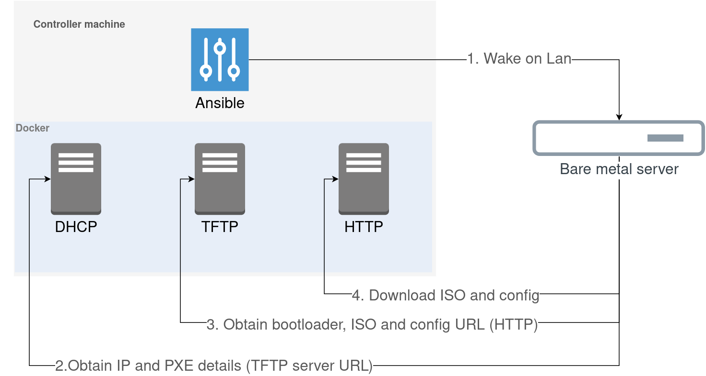

# OS installation over the network

> How to install an OS using using PXE boot

### PXE boot

The PXE environment is the process of having your device boot from its network card. 
To boot the device into the PXE environment, the device should get an instructions such as where to take a config and OS image. 
The most common way of trying to do this is to configure DHCP server to store and serve this information.

1. We send a Wake on Lan package to turn on the device. Device is configured to boot from PXE (via BIOS)
2. The device ask a DHCP server (configured to know PXE server details) for an IP and the TFTP server address
3. The device fetch the bootloader (boot configuration, kernel, initial ramdisk) and the HTTP server address.
4. Then it fetch the installation configuration (such as initial user to create, network configuration, system language, etc) and an OS iso image to install. After that, the OS installation started in automatic mode.

### PXE implementation

Ansible + Docker are used to create a working PXE environment. All the required servers is running on docker. 

Ansible is used to make an initial configuration (network config, download and mount ISO image, etc) of the PXE environment and trigger the device to power on.