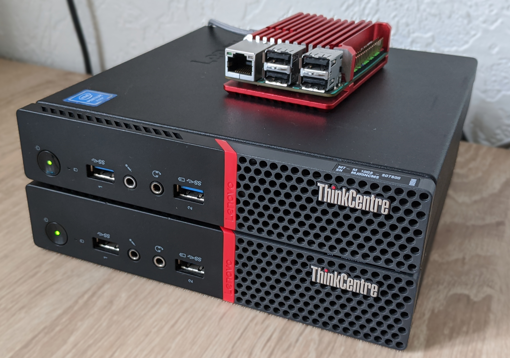
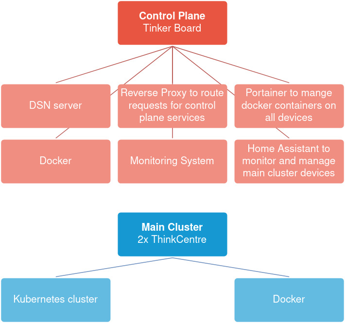

# Project overview

dev-lab is an efficient, fast, and easily configurable dev environment: a  self-hosting platform for any web services. The dev-lab is desingned to host any helper services for development work or personal usage. It is also a great sandbox for learning new technologies.

### Hardware

The current set of devices used for the project includes:

- 1x `Asus Tinker Board` (Raspberry Pi analog):
    - CPU: 4x core `Rockchip RK3288 ARM Cortex-A17 1.8GHz`
    - RAM: `2GB`
    - microSD: `32GB`
    - Features: `1G Ethernet`, `WiFi`, `Bluetooth`, `40 pins GPIO`, `4x USB 2.0`
    - OS: `Debian 9`

- 2x `Lenovo ThinkCentre M600 Tiny`:
    - CPU: 4x core` Intel Pentium J3710 @ 1.60GHz`
    - RAM: `8GB`
    - SSD: `128GB`
    - Features: `1G Ethernet`, `6x USB 3.0`, `WOL`, `PXE`
    - OS: `Ubuntu 20.04`

### Architecture

In the context of hardware, the platform can be divided into 2 parts: the control plane and the main cluster.
The Control Plane (hosted on ASUS Tinker Board) has services to monitor and manage all the services of the whole platform.

Hierarchically, the architecture looks like a stack, which is based on bare metal, and on top of the stack is the application layer, that is, services that are ready for use.

**The whole infrastructure should be provisioned automatically starting from bottom to top:**

- [Hardware layer](installation/hardware) - bare metal. The setup on this level is manual:
    - Enable WOL. Wake On Lan - protocol for waking computers up from a very low power mode remotely
    - Enable PXE. Preboot execution environment - for OS installation over network
- [OS layer](os):
    - OS installation via PXE
    - System configuration using Ansible
- [Infrastructure layer](insfastructure):
    - Install docker and docker-compose
    - Install k3s - lightweight Kubernetes cluster
- [Service layer](service):
    - Install portainer agents on every device and portainer server on control plane
    - Install local DNS server on control plane
    - Install homeassistant on control plane and load configuration. HA is using for power on/off devices using web UI and monitoring system resources (RAM, CPU, storage) for every device
    - Install monitoring tools:
        - Glances on cluster devices
        - Uptime Kuma on control plane, configure Uptime Kuma
    - Install Gitea git server
    - Install Drone CI/CD system
- [Application layer](application):
    - Deploy custom services (like kafkasender) on Kubernetes
    - Deploy services required for development work on Docker using Portainer

### Features

- [x] Power on/off devices via UI
- [x] Fast docker stacks management via UI
- [x] Private DNS server
- [x] DNS sinkhole used as network-wide ad blocker
- [x] Dashboard UI to access hosted services
- [x] Uptime monitoring system to monitor which services and devices are up or down, alerting to messengers (Telegram bot)
- [x] Git server backed up with Github
- [x] CI/CD platform
- [x] Documentation hosted on Kubernetes, backed up with Github pages
- [x] Automated infrastructure installation and management (k3s, docker)
- [x] Automatic OS provisioning
- [ ] Whole infrastructure provisioning with single command
- [ ] Managing Kubernetes using GitOps
- [ ] Remote IDE (Intellij IDEA server)
- [ ] Task management system
- [ ] Configuration management system for local development
- [ ] Everything is defined as code, use GitOps for everything
- [ ] Secrets and encryption management
- [ ] Centralized logs management system
- [ ] HTTPS everywhere
- [ ] Single sign-on
- [ ] Automatic backups
- [ ] Private container registry
- [ ] Expose some services to the internet securely (VPN server)
- [ ] Automatic OS updates

### Screenshots
Some screenshots are shown here (click to enlarge). They can't capture all the project's features, but they are sufficient to get a concept of it.

|                                                                                          |                                                                         |
|------------------------------------------------------------------------------------------|-------------------------------------------------------------------------|
| [![][screenshot-1]][screenshot-1]                                                        | [![][screenshot-2]][screenshot-2]                                       |
| Dashboard powered by [Homer](https://github.com/bastienwirtz/homer)                      | [Uptime Kuma](https://github.com/louislam/uptime-kuma) - uptime monitor |
| [![][screenshot-3]][screenshot-3]                                                        | [![][screenshot-4]][screenshot-4]                                       |
| Devices management dashboard powered by [Home Assistant](https://www.home-assistant.io/) | [PiHole](https://pi-hole.net/) - DNS server/Ad blocker                  |
| [![][screenshot-5]][screenshot-5]                                                        | [![][screenshot-6]][screenshot-6]                                       |
| [Portainer](https://www.portainer.io/) - Docker management                               | [Gitea](https://gitea.io/en-us/) - Git server                           |
| [![][screenshot-7]][screenshot-7]                                                        | [![][screenshot-8]][screenshot-8]                                       |
| [Drone](https://www.drone.io/) - CI/CD platform                                          | [Longhorn](https://longhorn.io/) - Persistent storage for Kubernetes    |

[screenshot-1]: ./assets/screenshot-1.png
[screenshot-2]: ./assets/screenshot-2.png
[screenshot-3]: ./assets/screenshot-3.png
[screenshot-4]: ./assets/screenshot-4.png
[screenshot-5]: ./assets/screenshot-5.png
[screenshot-6]: ./assets/screenshot-6.png
[screenshot-7]: ./assets/screenshot-7.png
[screenshot-8]: ./assets/screenshot-8.png
